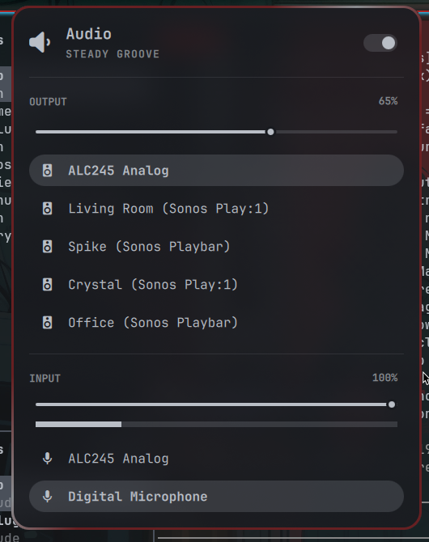

# Sonomarchy

Every Sonos zone on your network becomes a selectable system audio output in
Omarchy's sound panel. Pick "Office (Sonos Playbar)" the way you'd pick
headphones, and whatever the computer plays goes to that room.



It exists for the Sonos generation that has **no AirPlay** — Play:1, Play:3,
Play:5 (gen 1), Playbar, Playbase, Connect, Connect:Amp. If your speakers do
AirPlay 2 (One, Beam, Arc, Era, Five, Move, Roam, Amp, Port), you don't need
this: enable PipeWire's built-in RAOP discovery (`50-raop.conf`) and they show
up natively with lower latency.

Sonomarchy is a thin, Sonos-specific layer over
[pa-dlna](https://gitlab.com/xdegaye/pa-dlna). It is *output only* — it does
not control playback, groups or volume on the speakers. For that, pair it with
[OmaSonos](https://github.com/ctl0v0/omasonos); the two don't overlap.

## How it works

- The backend discovers Sonos players over UPnP and creates one PipeWire
  null-sink per **zone** (bonded stereo partners, surrounds and Subs are
  hidden — they can't be played to on their own).
- Selecting a zone's sink makes the speaker fetch an MP3 stream of that sink
  from this machine over HTTP. Latency is about 1–2 seconds: fine for music,
  wrong for video.
- pa-dlna's generic DLNA behaviour breaks on real Sonos hardware in several
  ways (chunked transfer, stale URLs after a network change, Spotify Connect
  holds, track-change teardown). Each one is patched at runtime and documented
  with what was observed, in `sonomarchy.py`.

## Requirements

- Omarchy with shell plugin support.
- Sonos players reachable from the same LAN (they are found by SSDP; no Sonos
  account or cloud involved).
- `python3` (3.9+) with `venv`, `libpulse` (for `parec`), and `lame` or
  `ffmpeg` for the MP3 encoder. The first start builds an isolated Python
  environment under `~/.local/share/io.github.nixfred.sonomarchy/venv` from
  the hash-locked `requirements.lock` (pa-dlna, libpulse, psutil), so it needs
  Internet access once.

### Firewall — read this, it's the #1 support question

The **speaker pulls audio from your computer**. With a default-deny firewall
(ufw on a stock install) that connection is dropped and you get silence with
no error. Allow the two ports from your LAN — as root, adjusting the subnet:

```bash
ufw allow proto tcp from 192.168.1.0/24 to any port 8080 comment 'Sonomarchy stream'
ufw allow proto udp from 192.168.1.0/24 to any port 8081 comment 'Sonomarchy discovery'
```

The plugin itself never touches the firewall or asks for elevated rights;
these rules are yours to add once.

8080/tcp is where the speakers fetch the stream (the first free port from
8080–8089 is used; the OSD tells you which if it isn't 8080). 8081/udp is where
speakers answer discovery. If a speaker is told to play and never fetches the
stream, Sonomarchy shows an OSD naming the port.

### VPN subnet routes — the #2 cause, and it looks exactly like a firewall

If the ports are open and a speaker still never fetches the stream, check
routing before touching the firewall again. A VPN that advertises your **LAN
subnet** will pull the reply into the tunnel: the speaker's SYN arrives on
your real interface, your SYN-ACK leaves through the VPN, and the handshake
never completes. Nothing is logged, and every firewall rule looks correct.

```bash
ip route get <speaker-ip> from <your-ip>   # must name your LAN interface
```

If that prints a tunnel (`tailscale0`, `wg0`, `tun0`...), that is your fault
line. With Tailscale it means a subnet router on your tailnet advertises the
LAN you are already sitting on. Fix it at the source by dropping the
advertisement on that node, which helps every device on the tailnet:

```bash
tailscale set --advertise-routes=          # on the subnet router
```

Or, on this machine only, stop accepting advertised routes:

```bash
tailscale set --accept-routes=false
```

Sonomarchy detects this case and names the interface in the log and OSD
instead of blaming the firewall.

## Install

```bash
omarchy plugin add https://github.com/nixfred/sonomarchy.git --enable
```

Then open the audio panel: your zones are in the output list. Nothing else to
configure. Discovery is SSDP, so zones trickle in over the first minute after
login or a network change rather than all at once.

If you already run pa-dlna yourself (by hand, or as a user service from a
manual install), stop and disable it first — pa-dlna refuses to run twice, and
the plugin will say so rather than fail silently.

## Behaviour worth knowing

- **A zone playing Spotify Connect** (or any Sonos "direct control" source)
  is taken over when you select its sink: the Spotify session is ended so the
  stream can start. That's intentional — selecting the output means "play
  here".
- **Changing networks** (dock/undock, wifi↔ethernet) restarts the backend
  automatically. Zones disappear for a few seconds and come back with correct
  stream addresses.
- **Track changes** are seamless as long as your player starts the next track
  within 10 s. After you stop playing, the speaker holds the stream for about
  10 s before releasing.
- **No track titles** appear in the Sonos app; Sonos rejects live-stream
  metadata updates, so they're disabled. Audio is unaffected.

## IPC

```bash
qs -c omarchy ipc call io.github.nixfred.sonomarchy status
qs -c omarchy ipc call io.github.nixfred.sonomarchy zones
qs -c omarchy ipc call io.github.nixfred.sonomarchy restart
```

## Uninstall

```bash
omarchy plugin remove io.github.nixfred.sonomarchy
rm -rf ~/.local/share/io.github.nixfred.sonomarchy
```

## Development

```bash
./scripts/validate-plugin.sh   # manifest, entry points, syntax
./scripts/test-local.sh        # unit tests against the plugin's own venv
```

## Credits

- [pa-dlna](https://gitlab.com/xdegaye/pa-dlna) by Xavier de Gaye does the
  real work.
- [pulseaudio-dlna](https://github.com/masmu/pulseaudio-dlna) documented the
  Sonos Content-Length problem years ago.
- [OmaSonos](https://github.com/ctl0v0/omasonos) set the pattern for a
  hash-locked Python backend inside an Omarchy plugin.

MIT © Fred Nix
